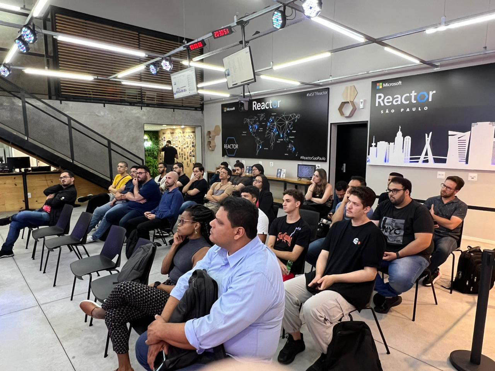
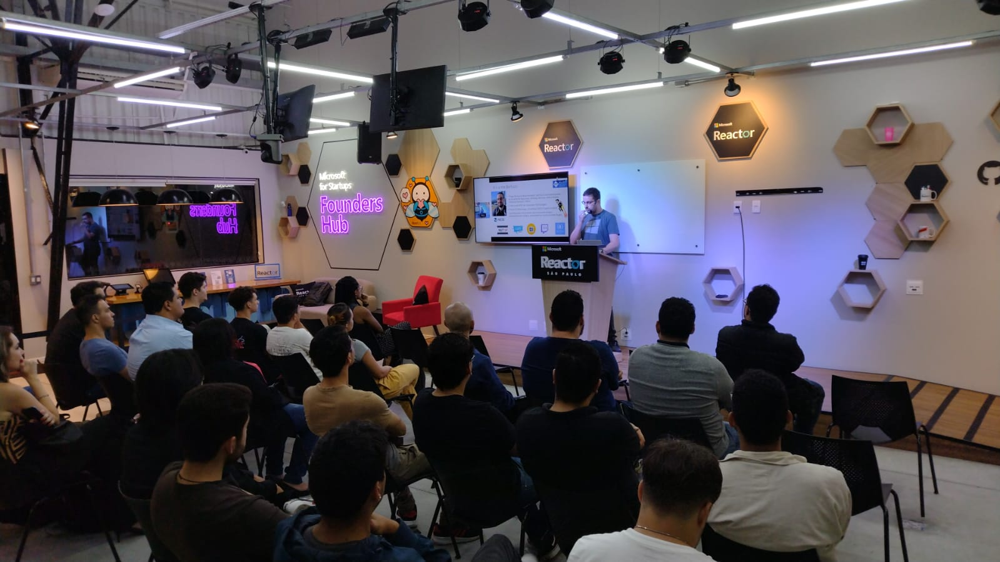
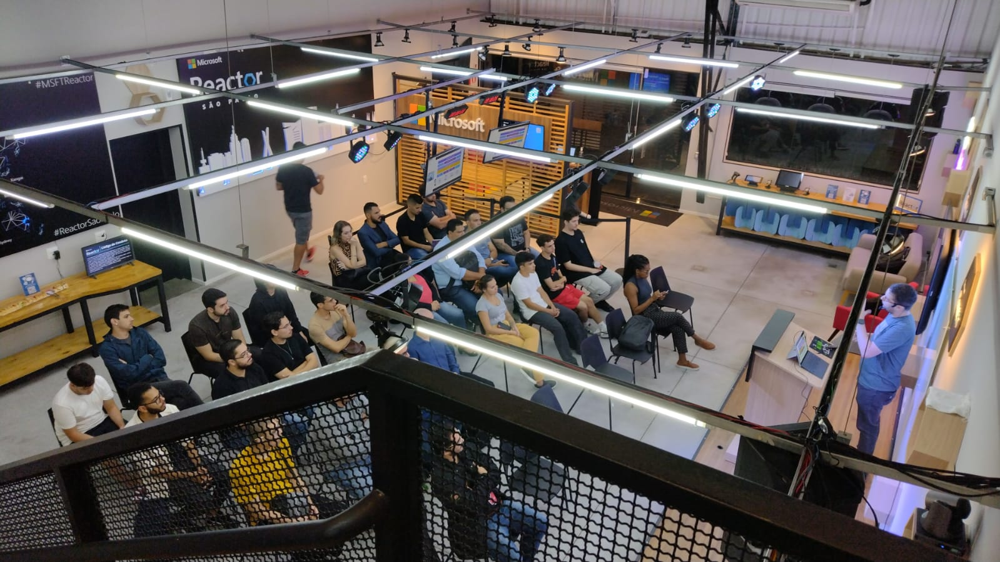
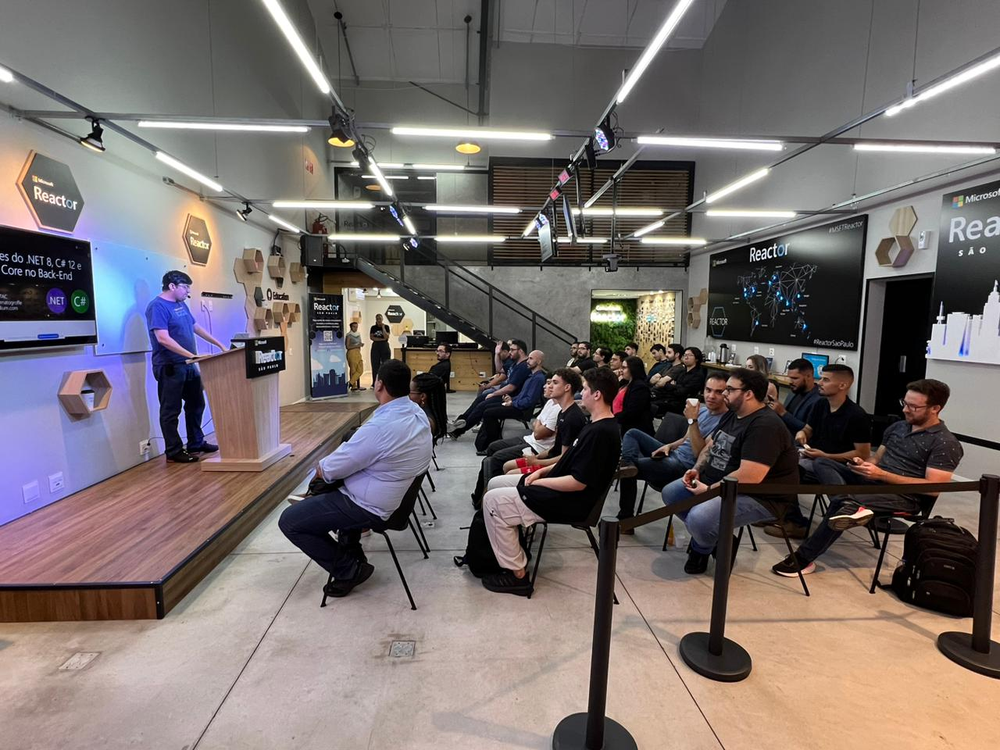
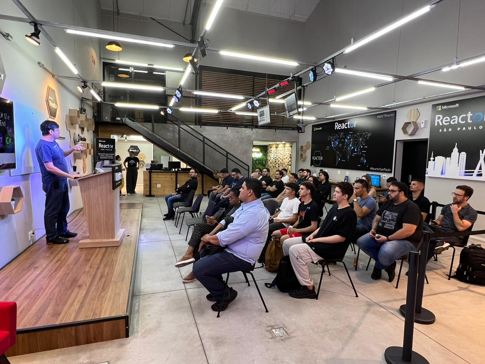
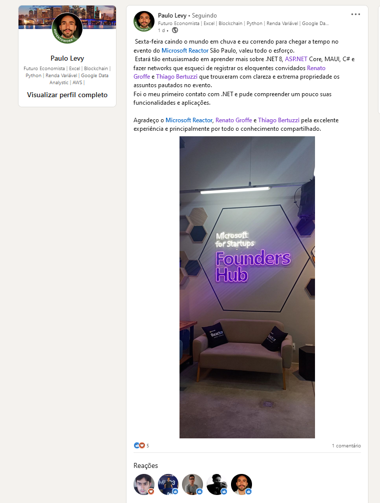
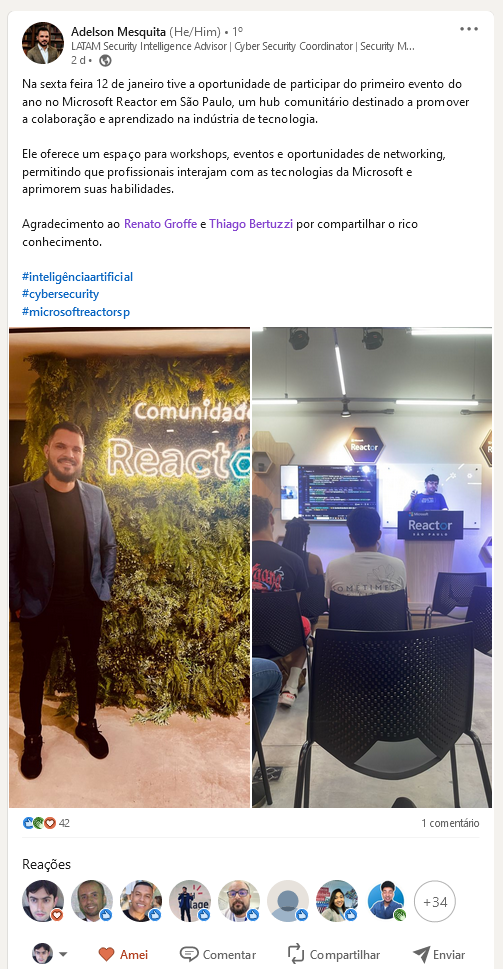
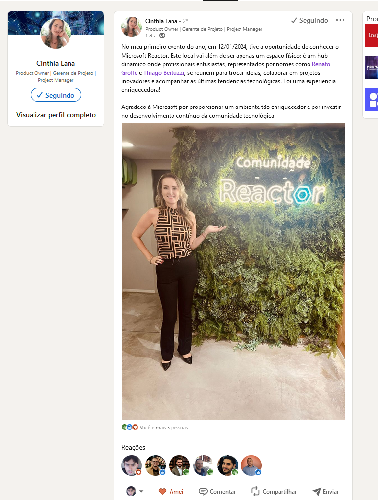

# .NET Conf 2024 - São Paulo-SP
Fotos e informações gerais sobre o evento ".NET Conf 2024 - São Paulo-SP - .NET, ASP.NET Core, MAUI e muito mais!", realizado em 12/01/2024 na cidade de São Paulo-SP.

Organizadores:
- **Renato Groffe (Microsoft MVP, MTAC)**
- **Thiago Bertuzzi (Microsoft MVP)**

Número de participantes: **28 pessoas**

Apresentações/talks que aconteceram durante o evento:
* **Novidades no Desenvolvimento Back-End com .NET 8 e ASP.NET Core - Renato Groffe (Microsoft MVP, MTAC)**

* **Novidades no Desenvolvimento Mobile com .NET 8 e MAUI - Thiago Bertuzzi (Microsoft MVP)**

Tecnologias abordadas: **.NET 8, ASP.NET Core, C# 12, Minimal APIs, MAUI, Visual Studio Code**

Acesse este [**link**](/img/) para visualizar todas as fotos das apresentações.

Este evento foi uma parceria entre a comunidade [**.NET SP**](https://www.meetup.com/dotnet-Sao-Paulo/) e o [**Microsoft Reactor**](https://www.meetup.com/Microsoft-Reactor-Sao-Paulo/).

Formulário utilizado para inscrições: [**Microsoft Reactor**](https://developer.microsoft.com/pt-br/reactor/events/21403/?wt.mc_id=1reg_21403_webpage_reactor)

Local: Microsoft Reactor - Rua Jaceru, 225 - Vila Gertrudes - São Paulo - SP - CEP: 04705-000

Deixamos aqui nossos agradecimentos ao Victor Temple e à Larissa Cyganski pela oportunidade e todo o apoio para promovermos esta edição local do .NET Conf no Microsoft Reactor em São Paulo-SP.

---

